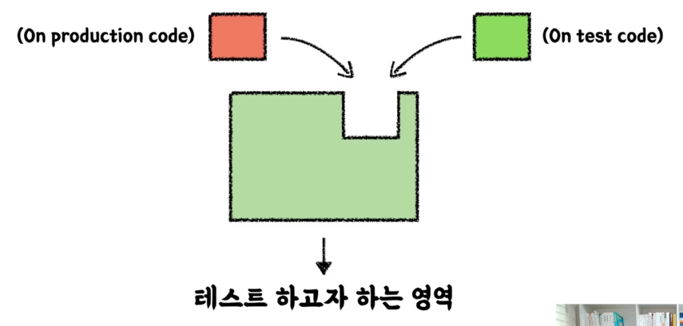

# 실용적인 테스트
## 요구사항
- 주문 목록에 음료 추가/삭제 기능
- 주문 목록 전체 지우기
- 주문 목록 총 금액 계산하기
- 주문 생성하기

### 추가 요구사항
```
이러한 추가 요구사항이 올 때에는 기획자에게 구현할 때 암묵적이거나 드러나지 않은 요구사항이 있는지 물어보는 것이 좋다.
```
- 한 종류의 음료 여러 잔을 한번에 담는 기능(수량 조절)
- 가게 운영 시간(10:00~ 22:00)에만 주문이 가능하도록 하기

## 자동화 테스트
### 단위 테스트
- 작은 코드 단위(클래스 or 메서드)를 독립적으로 검증하는 테스트
- 다른 테스트에 비해 검증 속도가 빠르고, 안정적이다.
- JUnit5(Java의 테스트 라이브러리), AssertJ(풍부한 API, 메서드 체이닝 지원) 사용

### 테스트 케이스 세분화 하기
- 해피 케이스
- 예외 케이스  
```
음료 숫자를 0이나 음수를 입력한다던지...
```
이러한 케이스를 테스트 할 때 주의해야 할 것이 **경계값 테스트**
- 범위(이상, 이하, 초과, 미만), 구간, 날짜 등
- 예를들어 3 이상의 조건을 테스트 할 때, 해피 케이스로 3을 넣고, 예외 케이스로 2를 넣어 테스트 할 수 있다.

### 테스트하기 어려운 영역을 구분하고 분리하기
테스트 가능한 영역에 테스트 하기 어려운 코드가 들어오게 되면 전체가 테스트하기 어려워 진다.

이렇게 해도 되는가??
- 예를 들어 createOrder() 메서드 내부에서 현재 시간을 사용한다면 테스트하기 어렵다. 같은 테스트라도 현재 시간에 따라 실패할 수도, 성공할 수도 있기 때문
- 이럴 때는 테스트 하기 어려운 영역을 외부로 분리하면 된다. createOrder() 메서드의 파라미터로 LocalDateTime을 받도록 하면 테스트가 용이해진다.
```
우리가 테스트하고자 하는 부분은 LocalDateTime이 아니다. 어떤 시간이 주어졌을 때 조건을 판단하는게 중요한 것!
테스트 코드 상에서 원하는 값을 넣어줄 수 있도록 설계를 변경하는 것이 중요하다.
```
**외부로 분리할 수록 테스트 가능한 코드는 많아진다.**
<br>
어느 단계까지 분리해야 하는가는 판단을 해야한다.

### 테스트하기 어려운 영역
- 관측할 때마다 다른 값에 의존하는 코드(현재 날짜/시간, 랜덤 값, 변수/함수, 사용자 입력 등)
- 외부 세계에 영향을 주는 코드(표준 출력, 메시지 발송, 데이터베이스에 기록하기 등)

### 테스트하기 쉬운 영역
순수함수
- 같은 입력에는 항상 같은 결과
- 외부 세상과 단절된 형태
- 테스트하기 쉬운 코드

### 📌 Lombok 사용 가이드
롬복은 사용하는 방법을 잘 알고 쓰는게 중요하다. 남발하면 유지보수하기 어려운 코드가 되기 때문.<br>
**@Data, @Setter, @AllArgsConstructor** 지양
- @AllArgsConstructor는 모든 필드를 초기화하는 생성자를 만들기 때문에 필요하지 않은 필드에도 값을 주입해야 한다. 불완전한 객체를 테스트하기 힘들어지므로 @AllArgsConstructor 대신 @RequiredArgsConstructor를 사용하자.
- @Data, @Setter를 사용하면 모든 필드를 변경할 수 있게 된다. 이는 객체의 불변성을 해치며 예기치 않은 사이드 이펙트를 유발할 수 있다.

@ToString은 가급적 DTO에만 사용(JPA 양방향 연관관계 시 순환 참조문제가 발생할 수 있기 때문)

## TDD(Test Driven Development)
프로덕션 코드보다 테스트 코드를 먼저 작성하여 테스트가 구현 과정을 주도하도록 하는 방법론<br>
**Red - Green - Refactor**
- Red: 실패하는 테스트를 작성
  - 구현부가 없이 테스트 코드를 먼저 작성하기 때문에 당연히 실패하는 테스트겠지?
- Green: 테스트를 통과하는 프로덕션 코드 작성
  - 테스트를 통과하는 코드를 작성한다. 초록불을 보기 위해선 구현이 엉터리여도 된다.
- Refactor: 프로덕션 코드와 테스트 코드를 리팩토링
  - 테스트를 통과하는 코드를 리팩토링한다. 테스트 코드가 있기 때문에 리팩토링을 하더라도 안전하다.

TDD의 장점으로는 내가 작성하는 프로덕션 코드에 대한 피드백을 바로 받을 수 있다는 점이다. <br>

선 기능 구현, 후 테스트 작성에서 생길 수 있는 문제점
- 테스트 자체의 누락 가능성도 있고 
- 특정 테스트 케이스(해피 케이스)만 검증할 가능성도 있고 
- 잘못된 구현을 다소 늦게 발견할 가능성도 있다.

선 테스트 작성, 후 기능 구현
- 복잡도가 낮은, 테스트 가능한 코드로 구현할 수 있게 한다.
- 쉽게 발견하기 어려운 엣지 케이스를 놓치지 않게 해준다.
- 구현에 대한 빠른 피드백을 받을 수 있다.
- 과감한 리팩토링이 가능해진다.

TDD는 관점의 변화를 일으키는 도구. <br>
기존 테스트의 관점은 테스트는 구현부의 검증을 위한 보조 수단이라면 TDD는 테스트와 상호 작용하며 발전하는 구현부이다.
```
클라이언트 관점에서 피드백을 주는 Test Driven 
```
TDD가 익숙하지 않은 사람들은 익숙해질 때까지 계속 도전하는 것이 중요하다. 물론 TDD가 모든 상황에 적합한 방법론은 아니다. 적절한 상황에 사용하면 좋은 것이지. 그런데 그 상황에 사용하려면 내가 능숙하게 할 수 있어야 사용할 수 있겠지?

## 테스트 코드는 [ ]다
### 문서
- 프로덕션 기능을 설명하는 테스트 코드 문서
- 다양한 테스트 케이스를 통해 프로덕션 코드를 이해하는 시각과 관점을 보완
- 어느 한 사람이 과거에 경험했던 고민의 결과물을 팀 차원으로 승격시켜서, 모두의 자산으로 공유할 수 있다.
```
우리는 항상 팀으로 일한다!
```
내가 작성한 코드가 다른 팀원한테 어떻게 비칠지 고민하는게 중요하다.

영문으로 된 테스트 메서드 이름만으로는 무엇을 나타내고 싶은지 한계가 있다.

### DisplayName을 섬세하게
명사의 나열보다 문장으로. "~테스트" 지양하기
- ~~음료 1개 추가 테스트~~
- 음료 1개를 추가할 수 있다.

테스트 행위에 대한 결과까지 기술하기
- ~~음료를 1개 추가할 수 있다.~~
- 음료를 1개 추가하면 주문 목록에 담긴다.

도메인 용어를 사용하여 한층 추상화된 내용을 담기. 메서드 자체의 관점보다 도메인 **정책** 관점으로
- ~~특정 시간 이전에 주문을 생성하면 실패한다.~~
- **영업 시작 시간** 이전에는 주문을 생성할 수 없다.

테스트의 현상을 중점으로 기술하지 말 것 (성공한다, 실패한다 ❌)

## BDD(Behavior Driven Development)
TDD에서 파생된 개발 방법
- 함수 단위의 테스트에 집중하기 보다, 시나리오에 기반한 **테스트 케이스** 자체에 집중하여 테스트한다.
- 개발자가 아닌 사람이 봐도 이해할 수 있을 정도의 추상화 수준(레벨)을 권장

### Given / When / Then
- Given: 시나리오 진행에 필요한 모든 준비 과정 (객체, 값, 상태 등)
- When: 시나리오의 행동 진행
- Then: 시나리오 진행에 대한 결과 명시, 검증

어떤 환경에서, 어떤 행동을 진행했을 때, 어떤 상태 변화가 일어난다.<br>
= DisplayName에 명확하게 작성할 수 있다.

참고용으로 Groovy의 BDD용 프레임워크 spock가 있다. 이 프레임워크는 태생부터 BDD를 위해 만들어진 것이기 때문에 Junit보다 명확하고 컨벤션을 잡기 쉽다.

```
언어가 사고를 제한한다.
```
이렇게 여러가지 장치를 사용해서 깔끔하고 명확한 명세로 정리하는 리소스를 들여야 하는가? 그렇다. 명확하게 작성되지 않은 테스트가 허들이 되어 우리의 사고를 제한하고 발목을 잡을 수 있기 때문이다. 그래서 문서로서 테스트가 강조되는 부분이다.

# 실용적인 Spring Boot & JPA 기반 테스트
## Layered Architecture
Spring MVC 기반에서 가장 많이 사용되는 아키텍처. 사용자 요청이 왔을 때 비즈니스 별로 나눠서 처리하는 방식

왜 레이어를 구분하는가?
```
관심사의 분리!
```
책임을 나누고 유지보수하기 용이하게 만들어보자! 그리고 레이어 별로 테스트를 해보자!

그런데 테스트하기 복잡해지는 것 아닌가? <br>
복잡해 보이지만 단위 테스트에서 언급했던 것과 기조는 동일하다.
- 테스트하기 어려운 부분을 분리해서 테스트하고자 하는 영역에 집중한다.
- 명시적이고 이해할 수 있는 문서 형태로 테스트를 작성한다.
- Spring과 JPA 같은 기술이 중요하다기 보다는 무엇을 테스트 할 것인지? 어떻게 테스트할 것인지에 대해서 집중

A + B = ? <br>
여러 객체가 협력해서 하나의 동작을 가능하게 하는 것은 과연 어떻게 예측할 수 있을까? <br>
단위 테스트만으로는 커버하기 어려운 영역들 생기기 시작한다.

## 통합 테스트 (Integration Test)
- 여러 모듈이 협력하는 기능을 통합적으로 검증하는 테스트
- 일반적으로 작은 범위의 단위 테스트만으로는 기능 전체의 신뢰성을 보장할 수 없다. 
- 풍부한 단위 테스트 & 큰 기능 단위를 검증하는 통합 테스트

## Spring
### Library vs Framework
Library: 내 코드가 주체. 필요한 기능이 있다면 외부에서 끌어와서 사용

Framework: 이미 동작할 수 있는 갖춰진 환경이 있고 내 코드는 수동적인 역할. 외부에서 제어권을 가지고 내 코드를 호출. 내 코드가 프레임워크에 의해 호출되는 형태

- **IoC**: DI와도 관련이 깊다. A 객체가 B 객체를 사용하려 할 때 원래는 A 객체가 new로 B 객체를 생성하고 사용하고 소멸까지 책임진다. 그런데 이렇게 되면 너무 강결합이게 된다. 이것을 약결합으로 만들기 위해 객체 생명주기 관리를 IoC 컨테이너에 위임해 IoC 컨테이너가 A 객체에 B 객체를 주입해주는 것이다.
- **DI**: A 객체는 B 객체가 필요한게 아니라 B 객체의 기능이 필요한 것이기 때문에 그 기능을 명세한 인터페이스를 두고 주입을 해 약결합으로 사용하는 것. A 객체는 B 객체의 기능을 하는 인스턴스를 받았는데 어디서 태어났고 어디서 와서 어디로 가는지는 모른다. 그저 주는 인스턴스를 사용하기만 하는 것.
- **AOP**: 트랜잭션, 로깅 등 비즈니스 흐름과 관계 없는 부가적인 흐름을 관점이라는 용어로 부르고 이 흩어진 관점을 하나로 모아서 분리를 하는 것. Spring에선 프록시를 사용해서 구현하고 있다.

이것들을 이해하고 테스트를 작성해야 한다.

## JPA
### ORM (Object Relational Mapping)
JPA는 ORM의 한 종류. 객체 지향 패러다임과 RDBMS 패러다임 간의 불일치를 해결하기 위한 기술
- 이전에는 개발자가 객체의 데이터를 한땀한땀 매핑하여 DB에 저장 및 조회 (CRUD)
- ORM을 사용함으로써 개발자는 단순 작업을 줄이고, 비즈니스 로직에 집중할 수 있음

### JPA (Java Persistence API)
Java 진영의 ORM 기술 표준
- JPA는 인터페이스이고, 여러 구현체가 있지만 보통 Hibernate를 많이 사용
- 반복적인 CRUD SQL을 생성 및 실행해주고, 여러 부가 기능들을 제공한다.
- 편리하지만 쿼리를 직접 작성하지 않기 때문에, 어떤 식으로 쿼리가 만들어지고 실행되는지 명확하게 이해하고 있어야 한다.
- Spring 진영에서는 JPA를 한번 더 추상화한 Spring Data JPA 제공
- QueryDSL과 조합하여 많이 사용한다. (타입체크, 동적쿼리)

JPA에서 주로 사용되는 어노테이션
- @Entity, @Id, @Column
- @ManyToOne, @OneToMany, @OneToOne, @ManyToMany (@ManyToMany은 일대다-다대일 관계로 풀어서 사용)

엔티티 설계
- Order와 Product는 다대다 관계이기 때문에 일대다-다대일 관계로 풀어서 설계한다.


### 요구사항 확장
- 키오스크 주문을 위한 상품 후보 리스트 조회하기
- 상품의 판매 상태: 판매중, 판매보류, 판매중지 → 판매중, 판매보류인 상태의 상품을 화면에 보여준다.
- id, 상품 번호, 상품 타입, 판매상태, 상품 이름, 가격이 필요
