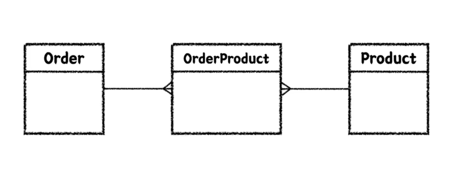

# 실용적인 테스트
## 요구사항
- 주문 목록에 음료 추가/삭제 기능
- 주문 목록 전체 지우기
- 주문 목록 총 금액 계산하기
- 주문 생성하기

### 추가 요구사항
```
이러한 추가 요구사항이 올 때에는 기획자에게 구현할 때 암묵적이거나 드러나지 않은 요구사항이 있는지 물어보는 것이 좋다.
```
- 한 종류의 음료 여러 잔을 한번에 담는 기능(수량 조절)
- 가게 운영 시간(10:00~ 22:00)에만 주문이 가능하도록 하기

## 자동화 테스트
### 단위 테스트
- 작은 코드 단위(클래스 or 메서드)를 독립적으로 검증하는 테스트
- 다른 테스트에 비해 검증 속도가 빠르고, 안정적이다.
- JUnit5(Java의 테스트 라이브러리), AssertJ(풍부한 API, 메서드 체이닝 지원) 사용

### 테스트 케이스 세분화 하기
- 해피 케이스
- 예외 케이스  
```
음료 숫자를 0이나 음수를 입력한다던지...
```
이러한 케이스를 테스트 할 때 주의해야 할 것이 **경계값 테스트**
- 범위(이상, 이하, 초과, 미만), 구간, 날짜 등
- 예를들어 3 이상의 조건을 테스트 할 때, 해피 케이스로 3을 넣고, 예외 케이스로 2를 넣어 테스트 할 수 있다.

### 테스트하기 어려운 영역을 구분하고 분리하기
테스트 가능한 영역에 테스트 하기 어려운 코드가 들어오게 되면 전체가 테스트하기 어려워 진다.

이렇게 해도 되는가??
- 예를 들어 createOrder() 메서드 내부에서 현재 시간을 사용한다면 테스트하기 어렵다. 같은 테스트라도 현재 시간에 따라 실패할 수도, 성공할 수도 있기 때문
- 이럴 때는 테스트 하기 어려운 영역을 외부로 분리하면 된다. createOrder() 메서드의 파라미터로 LocalDateTime을 받도록 하면 테스트가 용이해진다.
```
우리가 테스트하고자 하는 부분은 LocalDateTime이 아니다. 어떤 시간이 주어졌을 때 조건을 판단하는게 중요한 것!
테스트 코드 상에서 원하는 값을 넣어줄 수 있도록 설계를 변경하는 것이 중요하다.
```
**외부로 분리할 수록 테스트 가능한 코드는 많아진다.**
<br>
어느 단계까지 분리해야 하는가는 판단을 해야한다.

### 테스트하기 어려운 영역
- 관측할 때마다 다른 값에 의존하는 코드(현재 날짜/시간, 랜덤 값, 변수/함수, 사용자 입력 등)
- 외부 세계에 영향을 주는 코드(표준 출력, 메시지 발송, 데이터베이스에 기록하기 등)

### 테스트하기 쉬운 영역
순수함수
- 같은 입력에는 항상 같은 결과
- 외부 세상과 단절된 형태
- 테스트하기 쉬운 코드

### 📌 Lombok 사용 가이드
롬복은 사용하는 방법을 잘 알고 쓰는게 중요하다. 남발하면 유지보수하기 어려운 코드가 되기 때문.<br>
**@Data, @Setter, @AllArgsConstructor** 지양
- @AllArgsConstructor는 모든 필드를 초기화하는 생성자를 만들기 때문에 필요하지 않은 필드에도 값을 주입해야 한다. 불완전한 객체를 테스트하기 힘들어지므로 @AllArgsConstructor 대신 @RequiredArgsConstructor를 사용하자.
- @Data, @Setter를 사용하면 모든 필드를 변경할 수 있게 된다. 이는 객체의 불변성을 해치며 예기치 않은 사이드 이펙트를 유발할 수 있다.

@ToString은 가급적 DTO에만 사용(JPA 양방향 연관관계 시 순환 참조문제가 발생할 수 있기 때문)

## TDD(Test Driven Development)
프로덕션 코드보다 테스트 코드를 먼저 작성하여 테스트가 구현 과정을 주도하도록 하는 방법론<br>
**Red - Green - Refactor**
- Red: 실패하는 테스트를 작성
  - 구현부가 없이 테스트 코드를 먼저 작성하기 때문에 당연히 실패하는 테스트겠지?
- Green: 테스트를 통과하는 프로덕션 코드 작성
  - 테스트를 통과하는 코드를 작성한다. 초록불을 보기 위해선 구현이 엉터리여도 된다.
- Refactor: 프로덕션 코드와 테스트 코드를 리팩토링
  - 테스트를 통과하는 코드를 리팩토링한다. 테스트 코드가 있기 때문에 리팩토링을 하더라도 안전하다.

TDD의 장점으로는 내가 작성하는 프로덕션 코드에 대한 피드백을 바로 받을 수 있다는 점이다. <br>

선 기능 구현, 후 테스트 작성에서 생길 수 있는 문제점
- 테스트 자체의 누락 가능성도 있고 
- 특정 테스트 케이스(해피 케이스)만 검증할 가능성도 있고 
- 잘못된 구현을 다소 늦게 발견할 가능성도 있다.

선 테스트 작성, 후 기능 구현
- 복잡도가 낮은, 테스트 가능한 코드로 구현할 수 있게 한다.
- 쉽게 발견하기 어려운 엣지 케이스를 놓치지 않게 해준다.
- 구현에 대한 빠른 피드백을 받을 수 있다.
- 과감한 리팩토링이 가능해진다.

TDD는 관점의 변화를 일으키는 도구. <br>
기존 테스트의 관점은 테스트는 구현부의 검증을 위한 보조 수단이라면 TDD는 테스트와 상호 작용하며 발전하는 구현부이다.
```
클라이언트 관점에서 피드백을 주는 Test Driven 
```
TDD가 익숙하지 않은 사람들은 익숙해질 때까지 계속 도전하는 것이 중요하다. 물론 TDD가 모든 상황에 적합한 방법론은 아니다. 적절한 상황에 사용하면 좋은 것이지. 그런데 그 상황에 사용하려면 내가 능숙하게 할 수 있어야 사용할 수 있겠지?

## 테스트 코드는 [ ]다
### 문서
- 프로덕션 기능을 설명하는 테스트 코드 문서
- 다양한 테스트 케이스를 통해 프로덕션 코드를 이해하는 시각과 관점을 보완
- 어느 한 사람이 과거에 경험했던 고민의 결과물을 팀 차원으로 승격시켜서, 모두의 자산으로 공유할 수 있다.
```
우리는 항상 팀으로 일한다!
```
내가 작성한 코드가 다른 팀원한테 어떻게 비칠지 고민하는게 중요하다.

영문으로 된 테스트 메서드 이름만으로는 무엇을 나타내고 싶은지 한계가 있다.

### DisplayName을 섬세하게
명사의 나열보다 문장으로. "~테스트" 지양하기
- ~~음료 1개 추가 테스트~~
- 음료 1개를 추가할 수 있다.

테스트 행위에 대한 결과까지 기술하기
- ~~음료를 1개 추가할 수 있다.~~
- 음료를 1개 추가하면 주문 목록에 담긴다.

도메인 용어를 사용하여 한층 추상화된 내용을 담기. 메서드 자체의 관점보다 도메인 **정책** 관점으로
- ~~특정 시간 이전에 주문을 생성하면 실패한다.~~
- **영업 시작 시간** 이전에는 주문을 생성할 수 없다.

테스트의 현상을 중점으로 기술하지 말 것 (성공한다, 실패한다 ❌)

## BDD(Behavior Driven Development)
TDD에서 파생된 개발 방법
- 함수 단위의 테스트에 집중하기 보다, 시나리오에 기반한 **테스트 케이스** 자체에 집중하여 테스트한다.
- 개발자가 아닌 사람이 봐도 이해할 수 있을 정도의 추상화 수준(레벨)을 권장

### Given / When / Then
- Given: 시나리오 진행에 필요한 모든 준비 과정 (객체, 값, 상태 등)
- When: 시나리오의 행동 진행
- Then: 시나리오 진행에 대한 결과 명시, 검증

어떤 환경에서, 어떤 행동을 진행했을 때, 어떤 상태 변화가 일어난다.<br>
= DisplayName에 명확하게 작성할 수 있다.

참고용으로 Groovy의 BDD용 프레임워크 spock가 있다. 이 프레임워크는 태생부터 BDD를 위해 만들어진 것이기 때문에 Junit보다 명확하고 컨벤션을 잡기 쉽다.

```
언어가 사고를 제한한다.
```
이렇게 여러가지 장치를 사용해서 깔끔하고 명확한 명세로 정리하는 리소스를 들여야 하는가? 그렇다. 명확하게 작성되지 않은 테스트가 허들이 되어 우리의 사고를 제한하고 발목을 잡을 수 있기 때문이다. 그래서 문서로서 테스트가 강조되는 부분이다.

# 실용적인 Spring Boot & JPA 기반 테스트
## Layered Architecture
Spring MVC 기반에서 가장 많이 사용되는 아키텍처. 사용자 요청이 왔을 때 비즈니스 별로 나눠서 처리하는 방식

왜 레이어를 구분하는가?
```
관심사의 분리!
```
책임을 나누고 유지보수하기 용이하게 만들어보자! 그리고 레이어 별로 테스트를 해보자!

그런데 테스트하기 복잡해지는 것 아닌가? <br>
복잡해 보이지만 단위 테스트에서 언급했던 것과 기조는 동일하다.
- 테스트하기 어려운 부분을 분리해서 테스트하고자 하는 영역에 집중한다.
- 명시적이고 이해할 수 있는 문서 형태로 테스트를 작성한다.
- Spring과 JPA 같은 기술이 중요하다기 보다는 무엇을 테스트 할 것인지? 어떻게 테스트할 것인지에 대해서 집중

A + B = ? <br>
여러 객체가 협력해서 하나의 동작을 가능하게 하는 것은 과연 어떻게 예측할 수 있을까? <br>
단위 테스트만으로는 커버하기 어려운 영역들 생기기 시작한다.

## 통합 테스트 (Integration Test)
- 여러 모듈이 협력하는 기능을 통합적으로 검증하는 테스트
- 일반적으로 작은 범위의 단위 테스트만으로는 기능 전체의 신뢰성을 보장할 수 없다. 
- 풍부한 단위 테스트 & 큰 기능 단위를 검증하는 통합 테스트

## Spring
### Library vs Framework
Library: 내 코드가 주체. 필요한 기능이 있다면 외부에서 끌어와서 사용

Framework: 이미 동작할 수 있는 갖춰진 환경이 있고 내 코드는 수동적인 역할. 외부에서 제어권을 가지고 내 코드를 호출. 내 코드가 프레임워크에 의해 호출되는 형태

- **IoC**: DI와도 관련이 깊다. A 객체가 B 객체를 사용하려 할 때 원래는 A 객체가 new로 B 객체를 생성하고 사용하고 소멸까지 책임진다. 그런데 이렇게 되면 너무 강결합이게 된다. 이것을 약결합으로 만들기 위해 객체 생명주기 관리를 IoC 컨테이너에 위임해 IoC 컨테이너가 A 객체에 B 객체를 주입해주는 것이다.
- **DI**: A 객체는 B 객체가 필요한게 아니라 B 객체의 기능이 필요한 것이기 때문에 그 기능을 명세한 인터페이스를 두고 주입을 해 약결합으로 사용하는 것. A 객체는 B 객체의 기능을 하는 인스턴스를 받았는데 어디서 태어났고 어디서 와서 어디로 가는지는 모른다. 그저 주는 인스턴스를 사용하기만 하는 것.
- **AOP**: 트랜잭션, 로깅 등 비즈니스 흐름과 관계 없는 부가적인 흐름을 관점이라는 용어로 부르고 이 흩어진 관점을 하나로 모아서 분리를 하는 것. Spring에선 프록시를 사용해서 구현하고 있다.

이것들을 이해하고 테스트를 작성해야 한다.

## JPA
### ORM (Object Relational Mapping)
JPA는 ORM의 한 종류. 객체 지향 패러다임과 RDBMS 패러다임 간의 불일치를 해결하기 위한 기술
- 이전에는 개발자가 객체의 데이터를 한땀한땀 매핑하여 DB에 저장 및 조회 (CRUD)
- ORM을 사용함으로써 개발자는 단순 작업을 줄이고, 비즈니스 로직에 집중할 수 있음

### JPA (Java Persistence API)
Java 진영의 ORM 기술 표준
- JPA는 인터페이스이고, 여러 구현체가 있지만 보통 Hibernate를 많이 사용
- 반복적인 CRUD SQL을 생성 및 실행해주고, 여러 부가 기능들을 제공한다.
- 편리하지만 쿼리를 직접 작성하지 않기 때문에, 어떤 식으로 쿼리가 만들어지고 실행되는지 명확하게 이해하고 있어야 한다.
- Spring 진영에서는 JPA를 한번 더 추상화한 Spring Data JPA 제공
- QueryDSL과 조합하여 많이 사용한다. (타입체크, 동적쿼리)

JPA에서 주로 사용되는 어노테이션
- @Entity, @Id, @Column
- @ManyToOne, @OneToMany, @OneToOne, @ManyToMany (@ManyToMany은 일대다-다대일 관계로 풀어서 사용)

엔티티 설계
- Order와 Product는 다대다 관계이기 때문에 일대다-다대일 관계로 풀어서 설계한다.


### 요구사항 확장
- 키오스크 주문을 위한 상품 후보 리스트 조회하기
- 상품의 판매 상태: 판매중, 판매보류, 판매중지 → 판매중, 판매보류인 상태의 상품을 화면에 보여준다.
- id, 상품 번호, 상품 타입, 판매상태, 상품 이름, 가격이 필요

## Persistence Layer Test
- Data Access의 역할
- 비즈니스 가공 로직이 포함되어서는 안 된다. Data에 대한 CRUD에만 집중한 레이어

### JPA 쿼리 메서드도 테스트를 해야하는가?

JPA가 아닌 다른 방법으로 구현이 변경될 수도 있고 쿼리메서드도 내가 작성한 코드이므로 제대로 된 쿼리가 날아가는지 보장을 해야한다. 그래서 테스트를 작성하는 것이 좋다.<br>
Repository 테스트는 스프링을 띄워서 하는 통합 테스트이지만 단위 테스트 성격에 가까운 테스트. 레이어 별로 끊어서 봤을 때에는 데이터베이스에 엑세스 하는 로직만 가지고 있기 때문<br>
`@SpringBootTest`를 사용하면 테스트를 돌릴 때 스프링부트를 띄워서 테스트를 돌린다. `@DataJpaTest`를 사용하면 마찬가지로 스프링부트를 띄우는데 JPA 관련된 빈만 등록해서 테스트를 돌리기 때문에 더 가볍다. 하지만 필자는 `@SpringBootTest`를 사용하는 것을 선호한다. 그 이유는 추후 서술

## Business Layer Test
- 비즈니스 로직을 구현하는 역할
- Persistence Layer와 상호작용(Data를 읽고 쓰는 행위)을 통해 비즈니스 로직을 전개시킨다.
- **트랜잭션**을 보장해야 한다.

비즈니스 레이어 테스트는 통합적으로 동작을 하는지 Persistence Layer와 Business Layer 테스트를 한꺼번에 한다.

### 요구사항 확장
- 상품 번호 리스트를 받아 주문 생성하기
- 주문은 주문 상태, 주문 등록 시간을 가진다.
- 주문의 총 금액을 계산할 수 있어야 한다.
- 주문 생성 시 재고 확인 및 개수 차감 후 생성하기
- 재고는 상품번호를 가진다.
- 재고와 관련 있는 상품 타입은 병 음료, 베이커리이다.

서비스 테스트는 클랜징을 해주지 않으면 테스트 간 간섭이 생겨 실패하지만 레포지토리 테스트는 클랜징을 해주지 않아도 성공한다. 왜 그럴까?
- 레포지토리 테스트에선 `@DataJpaTest`를 사용하고 있고 서비스 테스트에선 `@SpringBootTest`를 사용하고 있다. `@DataJpaTest`는 내부에 `@Transactional`이 달려있어서 테스트가 끝나면 롤백을 해주기 때문에 테스트 간 간섭이 없다. 하지만 `@SpringBootTest`는 롤백을 해주지 않기 때문에 테스트 간 간섭이 생길 수 있다.
- @SpringBootTest를 사용하고 있는 서비스 테스트에 @Transactional을 사용하면 롤백이 된다. 하지만 이렇게 사용하면 생길 수 있는 문제가 있다.

OrderService의 createOrder()에서도 재고 체크를 해서 예외를 던지고, Stock의 deductQuantity()에서도 재고 체크를 해서 예외를 던지는데 왜 중복으로 만들었나? 어차피 OrderService에서 걸리면 Stock에서 걸릴일이 없을 텐데?
- 관점을 다르게 보면 된다. 서비스에서 지나간 체크는 주문 생성을 진행하다가 재고에 대한 차감을 시도하는 과정이고, Stock 자체의 메서드는 밖에 서비스가 어떻게 되어 있는지 전혀 모른다. 수량을 차감한다고 했을 때 항상 단위 테스트에서 보장을 해줄 수 있어야 한다. 그래서 서비스에서 예외를 던지는 상황과 Stock에서 예외를 던지는 상황은 다르다. 그래서 예외 메시지도 다르게 준 것.

### 🚨 잘 알고 쓰자 `@Transactional`
JPA의 더티체킹을 사용한 로직을 테스트하려면 트랜잭션 경계가 설정되어 있어야 한다. update 쿼리가 안나가기 때문. (spring data jpa의 save나 delete에는 내부적으로 `@Transactional`이 달려있어서 서비스 레이어에 `@Transactional`을 달아주지 않아도 동작한다.)

그래서 Service에 트랜잭션을 활용한 롤백 테스트를 할 때 잘 알고 써야 한다. `@Transactional` 자체가 테스트 후처리를 고민하지 않아도 되서 되게 편리하긴 한데 테스트 코드에 `@Transactional`을 사용하면 실제 프로덕션 코드에 트랜잭션 경계가 설정된 것 처럼 보인다. 실제로는 프로덕션 코드에 트랜잭션 경계가 설정되어 있지 않은데도.

때문에 이러한 부작용을 인지를 하고 사용해야 한다. 실무에서 트랜잭션으로 롤백하는 방식을 사용할 때에는 팀 내에서 공유를 하고 인지를 하고있는지 체크해야 한다.

### read only Transaction
`@Transactional(readOnly = true)`를 사용하면 읽기 전용 트랜잭션이 열린다.<br>
readOnly = true : 읽기전용<br>
CRUD 에서 CUD 동작 X / only Read<br>
JPA를 사용할 때 영향점 : CUD 스냅샷 저장, 변경감지 X (성능 향상)

**CQRS 패턴** - Command / Query를 의도적으로 분리해서 책임을 분리한다.<br>
보통의 서비스라면 Command 보다는 Query의 빈도가 2:8정도로 높다.<br>
Query가 많이 몰려서 Command까지 같이 동작을 안해버리면 큰 문제. 그렇기 때문에 애플리케이션 단에서 분리해서 관리하자고 나온 것이 CQRS 패턴. DB에 대한 엔드포인트를 관리할 수 있다.<br>
요즘엔 Read용 DB랑 Write용 DB를 나눠서 쓰는 편. Master-Slave 구조. Master DB에 Write만 하고 마스터의 레플리카인 Slave DB는 Read만 한다.<br>
readOnly = true가 붙어있으면 Slave로 보내자 이렇게 의식할 수 있음. 이렇게 DB 엔드포인트를 구분함으로써 장애 격리를 할 수 있는 좋은 포인트가 된다.<br>
AWS Aurora DB 클러스트 모드를 쓰면 같은 엔드포인트라도 readOnly 값을 보고 알아서 구분을 해준다.

CQRS 패턴을 사용하지 않더라도 readOnly = true를 붙이는 것은 좋은 습관이다.<br>
메서드마다 달면 깜박하고 누락될 수 있기 때문에 서비스 클래스 상단에 readOnly = true를 걸고 CUD를 하는 부분에만 @Transactional을 붙이는 것을 추천한다.

### 상품이 추가될 때마다 1씩 증가시키는 productNumber의 동시성 이슈
해결 방법은 여러가지가 있겠지만
그 중 한 예시로 빈도수가 높지 않다면 DB의 productNumber 필드에 유니크 제약 조건을 걸고 시스템에서 최대 3회정도 재시도하는 로직을 만들 수도 있다.<br>
만약 동시 접속자가 너무 많아 크리티컬한 경우에는 productNumber를 증가하는 값이 아니라 UUID 같은 걸 사용한다던지 정책을 다르게 가져가야 할 수도 있다.

## Presentation Layer Test
- 외부 세계의 요청을 가장 먼저 받는 계층
- 파라미터에 대한 최소한의 검증을 수행한다.

persistance layer와 business layer는 테스트는 스프링 부트를 통으로 띄워서 테스트를 했다. 그런데 presentation layer는 컨트롤러를 테스트할 때에는 하위 레이어를 Mocking해서 테스트를 한다. 다른 부분을 테스트에 포함하지 않고 내가 테스트 할 부분에만 집중에서 테스트를 하기 위함. 약간 단위 테스트 느낌

### Mock
- 외부 의존성을 가질 때, 외부 의존성을 대신하는 가짜 객체
- 스프링에서 제공하는 테스트용 MockMvc 프레임워크를 사용할 것

### 요구사항 확장
- 관리자 페이지에서 신규 상품 등록할 수 있다.
- 상품명, 상품 타입, 판매 상태, 가격 등을 입력받는다.

이러한 재고 관련 부분은 여러 사용자가 있을 경우 동시성 문제가 발생하기 쉬운데 이 때 Lock을 사용해서 해결하는 방법이 있다.

JPA의 Auditing 설정이 WebMvcTest에서 동작하지 않는 이유는?
- WebMvcTest는 스프링 부트를 띄우지 않고 테스트하기 때문에 스프링 부트가 제공하는 기능들이 동작하지 않는다. 그래서 Auditing 설정이 동작하지 않는 것이다.
- 그래서 config를 분리해서 빈을 올려주자. 그러면 WebMvcTest에서도 동작한다.

### String 값을 검증할 때 @NotNull, @NotEmpty, @NotBlank 차이
- `@NotNull`: null이 아닌지 검증. emtpy string과 공백은 통과
- `@NotEmpty`: null이 아니고 size가 0이 아닌지 검증. 공백은 통과
- `@NotBlank`: null이 아니고 trim한 결과가 size가 0이 아닌지 검증

### 상품 이름의 길이를 검증한다고 할 때
request dto에서 @Max를 사용해서 검증하는게 맞나?<br> 
이름에 대해 20자 제한 정책이 과연 컨트롤러 단에서 튕겨낼 책임이 맞는가?

위에 있는 `@NotBlank` 같은 것은 유효한 문자열이라면 합당히 가져야할 속성에 대한 검증이라면, 이건 도메인 정책같은 특수한 검증이다.<br>
그래서 컨트롤러 단에서는 `@NotBlank` 테스트만 해서 String에 대한 최소한의 조건만 테스트. 20자 제한은 서비스 레이어에서 검증을 하던 도메인 객체에서 검증을 하는게 맞다고 생각한다.

### 컨트롤러에서 사용하고 있는 request dto를 서비스 레이어에서도 사용을 하면
컨트롤러에서 사용하는 request dto를 서비스 레이어에 그대로 넘겨서 사용하면 서로 의존 관계가 생겨버린다. 나중에 서비스가 커져서 서비스 레이어와 컨트롤러 레이어의 모듈을 분리하고 싶어진다고 할 때 이 Reqeust DTO가 허들이 될 수 있다.

레이어드 아키텍처에서 가장 좋은 구조는 하위 레이어가 상위 레이어를 모르는 구조이다. 컨트롤러 레이어가 서비스 레이어 빈을 주입받아서 사용하는 형태잖아? 상위는 하위를 호출할 거니까 알고 있는게 당연하지만 하위 레이어가 상위 레이어를 알고 있는건 좋은 그림이 아니다. 그래서 서비스용 Request DTO를 따로 만들어주는 게 좋다.

이렇게 되면 ServiceRequestDto에서는 컨트롤러에서 검증이 끝난 것을 변환받기 때문에 검증 어노테이션을 사용할 필요가 없다. 모듈을 분리하게 될 ServiceReqeustDto 경우 POJO로 유지해 책임을 확실히 나눌 수 있는 것이다.<br> 
물론 이렇게 나누는게 귀찮긴 하다. 하지만 서비스가 커지면 커질수록 이런 구조가 필요하다. 같은 서비스레이어를 사용한다고 할 때 특정 컨트롤러의 DTO를 다른 컨트롤러의 API들도 알 필요는 없으니까.

# 기타 키워드

## Hexagonal Architecture
Layered Architecture의 한계를 극복하기 위한 아키텍처.

레이어드 아키텍처에선 JPA를 사용해 테이블과 매핑하기 위해 Order라는 엔티티를 도메인 객체로 사용하고 있다. 이건 데이터베이스와 매핑하기 위한 객체이고 Order가 가지고 있는 총 금액을 계산한다던가 하는 도메인 로직들은 분리가 되어야하지 않을까 고민을 한 것.<br> 
현재의 도메인 객체는 데이터베이스와 너무 강결합. 특히 JPA와 강결합이다. repository에도 JpaRepository를 사용하고 있는 상태에서 프로젝트가 커져버리면 JPA를 떼어내고 다른 ORM을 사용하기가 쉽지 않게 된다.
```
도메인 객체가 하위 인프라 레이어와 이렇게 강한 의존관계를 가지는게 맞나?
```
라는 고민에서 나온 것이 Hexagonal Architecture이다.

헥사고날 아키텍처로 검색해서 이미지를 찾아보면 육각형으로 그려진 이미지가 많이 나온다.

도메인 모델이 중심이 되고 그 주위에는 포트가 존재한다. 이 포트와 연결하는 어댑터들이 존재한다. 그 외부 세계에는 클라이언트가 될 수도 있고, 데이터베이스가 될 수도 있다. 외부의 시스템들이 어댑터를 통해서만 도메인에 접근하게 된다.<br>
이렇게 되면 도메인 모델은 외부의 것들은 전혀 모르는 상태가 된다. 이게 어떻게 가능하냐? 스프링의 DI의 개념을 확장시켜서 활용하는 것이다. 하나의 추상화된 인터페이스를 두고, 이 것을 구현하는 구현체를 따로 두어 런타임 시점에 주입을 해준다면 실제 우리가 구현한 도메인 객체는 JPA라는 구현 기술을 몰라도 되는 것이다.

모노레포의 작은 시스템이라면 레이어드 아키텍처가 편하고 좋다. 그러나 시스템이 커지고 모듈이 점점 많아지면 헥사고날 아키텍처를 사용하면 좋다.

## QueryDSL
JPA를 사용하는 프로젝트에는 QueryDSL을 사용하는 것을 추천한다. QueryDSL은 JPQL을 자바 코드로 작성할 수 있게 해주는 라이브러리이다. JPQL은 문자열로 작성하기 때문에 오타가 나거나 컴파일 시점에 잡히지 않는다. 하지만 QueryDSL은 자바 코드로 작성하기 때문에 컴파일 시점에 잡히기 때문에 안전하다. 또한 빌더 패턴을 사용해 동적 쿼리를 작성할 수 있어서 유지보수하기 좋다.

